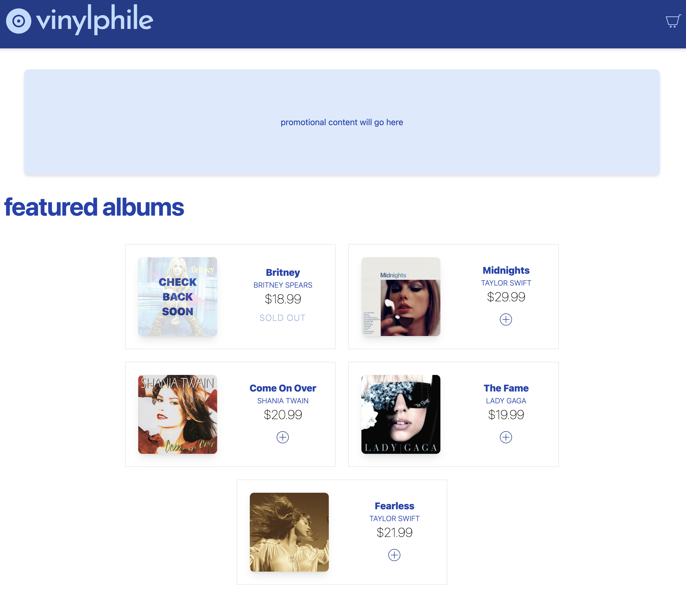

# Vinylphile

Vinylphile is a concept e-commerce platform that sells vinyl records direct-to-consumer.

<a href="https://vinylphile-56bf9.web.app" target="_blank">
Click here to check it out
</a>

 
<b>Finished Product:</b>
 

 
<b>As of 3/2023:</b>
 

 
<b>Orignal Concept:</b>
 

 

## Frontend

- React.js / Vite.js
- Tailwind CSS

## Backend

- Node.js / Express.js
- Stripe
- Google Cloud

## No Longer Using
- AWS DynamoDB
    - After building a database with Stripe's products database, I realized it wasn't neccessary to have DynamoDB to save the information. However, I will most likely need to come up with a solution for tracking inventory as the Stripe API has limited inventory management functionality.
- AWS EC2, AWS S3
    - Decided to take the approach to deploy straight to Google Cloud for the sake of efficiency and pricing. 
